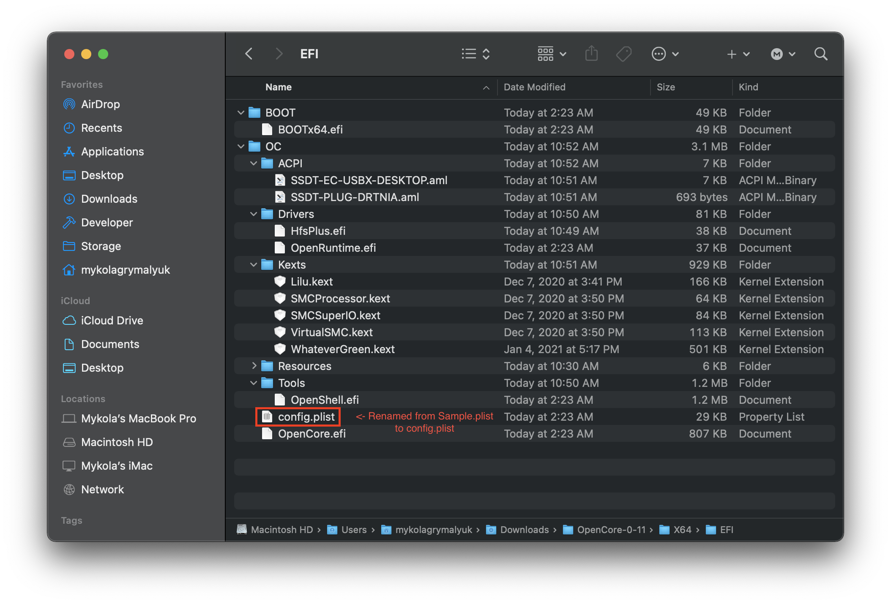

# Настройка config.plist

Теперь, когда у нас есть все наши кексты(.kext), SSDT(.aml) и драйверы прошивки, ваш USB должен выглядеть примерно так:

* **Примечание**: Ваш USB **будет выглядеть по-другому**, у каждой системы разные требования.

## Создание вашего config.plist

Для начала, нам нужно взять sample.plist из [OpenCorePkg](https://github.com/acidanthera/OpenCorePkg/releases), он будет находится в папке `Docs`:

Дальше, давайте переместим его на EFI раздел USB(будет называться BOOT в Windows) в `EFI/OC/`, и переименуем его в config.plist:

## Добавление ваших SSDT, кекстов и драйверов прошивки

Для остальной части этого руководства, вам нужно будет как-то редактировать plist. И в нашем руководстве мы будем использовать ProperTree и GenSMBIOS, чтобы помочь автоматизировать часть утомительной работы:

* [ProperTree](https://github.com/corpnewt/ProperTree)
  * Универсальный plist редактор
* [GenSMBIOS](https://github.com/corpnewt/GenSMBIOS)
  * Для генерации наших SMBIOS данных

Далее, давайте откроем ProperTree и отредактируем наш config.plist:

* `ProperTree.command`
  * Для macOS
  * Подсказка: есть утилита `buildapp.command` в папке `Scripts`, которая превратит ProperTree в отдельное приложение для macOS
* `ProperTree.bat`
  * Для Windows

Когда запустите ProperTree, откройте ваш config.plist нажатием **Cmd/Ctrl + O** и выберите файл `config.plist` на вашем USB.

После того как открыли конфиг, нажмите **Cmd/Ctrl + Shift + R** и выберите вашу EFI/OC папку, чтобы совершить "Clean Snapshot":

* Это удалит все записи из config.plist и затем добавит все ваши SSDT, кексты и драйверы прошивки в конфиг
* **Cmd/Ctrl + R** это другая опция, которая добавит все ваши файлы, но оставит записи отключенными, если они были настроены таким образом раньше, полезно при решении проблем, но нам сейчас не нужно

Когда всё сделано, вы увидите ваши SSDT, кексты и драйверы прошивки заполненными в config.plist:

* **Примечание:** Если у вас появится окно "Disable the following kexts with Duplicate CFBundleIdentifiers?", нажмите "Yes". Это делается для того, чтобы убедиться, что у вас не будут инжектироваться дублирующиеся кексты, поскольку некоторые кексты могут иметь одни и те же плагины(например, VoodooInput находящийся как в VoodooPS2, так и в VoodooI2C)

Если вы хотите немного почистить файл, вы можете удалить записи `#WARNING`. Хотя они оставаясь там не вызывают проблем, поэтому это личное предпочтение.

## Выбор вашей платформы

Теперь наступает важная часть - выбор пути конфигурации. У каждой платформы есть свои уникальные особенности, которые вам необходимо учитывать, поэтому очень важно знать свое оборудование. Смотрите ниже, что делать дальше:

### Настольные Intel

* Примечание: Серия Intel NUC считается мобильным оборудованием, для этих ситуаций мы рекомендуем следовать [разделу Intel ноутбуки](#intel-laptop)

| Кодовое название | Серия | Выход |
| :--- | :--- | :--- |
| [Yonah, Conroe и Penryn](../config.plist/penryn.md) | E8XXX, Q9XXX, [etc 1](https://en.wikipedia.org/wiki/Yonah_(microprocessor)), [etc 2](https://en.wikipedia.org/wiki/Penryn_(microarchitecture)) | 2006-2009 г.|
| [Lynnfield и Clarkdale](../config.plist/clarkdale.md) | 5XX-8XX | 2010 г. |
| [Sandy Bridge](../config.plist/sandy-bridge.md) | 2XXX | 2011 г. |
| [Ivy Bridge](../config.plist/ivy-bridge.md) | 3XXX | 2012 г. |
| [Haswell](../config.plist/haswell.md) | 4XXX | 2013-2014 г. |
| [Skylake](../config.plist/skylake.md) | 6XXX | 2015-2016 г. |
| [Kaby Lake](../config.plist/kaby-lake.md) | 7XXX | 2017 г. |
| [Coffee Lake](../config.plist/coffee-lake.md) | 8XXX-9XXX | 2017-2019 г. |
| [Comet Lake](../config.plist/comet-lake.md) | 10XXX | 2020 г. |

### Ноутбуки Intel

| Кодовое название | Серия | Выход |
| :--- | :--- | :--- |
| [Clarksfield и Arrandale](../config-laptop.plist/arrandale.md) | 3XX-9XX | 2010 г. |
| [Sandy Bridge](../config-laptop.plist/sandy-bridge.md) | 2XXX | 2011 г. |
| [Ivy Bridge](../config-laptop.plist/ivy-bridge.md) | 3XXX | 2012 г. |
| [Haswell](../config-laptop.plist/haswell.md) | 4XXX | 2013-2014 г. |
| [Broadwell](../config-laptop.plist/broadwell.md) | 5XXX | 2014-2015 г. |
| [Skylake](../config-laptop.plist/skylake.md) | 6XXX | 2015-2016 г. |
| [Kaby Lake и Amber Lake](../config-laptop.plist/kaby-lake.md) | 7XXX | 2017 г. |
| [Coffee Lake и Whiskey Lake](../config-laptop.plist/coffee-lake.md) | 8XXX | 2017-2018 г. |
| [Coffee Lake Plus и Comet Lake](../config-laptop.plist/coffee-lake-plus.md) | 9XXX-10XXX | 2019-2020 г. |
| [Ice Lake](../config-laptop.plist/icelake.md) | 10XXX | 2019-2020 г. |

### Intel HEDT

Этот раздел включает оборудование как для энтузиастов, так и серверное.

| Кодовое название | Серия | Выход |
| :--- | :--- | :--- |
| [Nehalem и Westmere](../config-HEDT/nehalem.md) | 9XX, X3XXX, X5XXX, [etc 1](https://en.wikipedia.org/wiki/Nehalem_(microarchitecture)), [2](https://en.wikipedia.org/wiki/Westmere_(microarchitecture)) | 2008-2010 г. |
| [Sandy/Ivy Bridge-E](../config-HEDT/ivy-bridge-e.md) | 3XXX, 4XXX | 2011-2013 г. |
| [Haswell-E](../config-HEDT/haswell-e.md) | 5XXX | 2014 г. |
| [Broadwell-E](../config-HEDT/broadwell-e.md) | 6XXX | 2016 г. |
| [Skylake/Cascade Lake-X/W](../config-HEDT/skylake-x.md) | 7XXX, 9XXX, 10XXX | 2017-2019 г. |

### AMD

| Кодовое название | Серия | Выход |
| :--- | :--- | :--- |
| [Bulldozer/Jaguar](../AMD/fx.md) | [Непонятно](https://en.wikipedia.org/wiki/List_of_AMD_processors#Bulldozer_architecture;_Bulldozer,_Piledriver,_Steamroller,_Excavator_(2011%E2%80%932017)) | [AMD реально были плохи в названиях раньше](https://en.wikipedia.org/wiki/List_of_AMD_processors#Bulldozer_architecture;_Bulldozer,_Piledriver,_Steamroller,_Excavator_(2011%E2%80%932017)) |
| [Zen](../AMD/zen.md) | 1XXX, 2XXX, 3XXX, 5XXX | 2017-2020 г. |

* Примечание: ~~Threadripper 3его поколения(39XX) не поддерживаются, однако 1ое и 2ое поколение поддерживается~~
  * Последние версии BIOS и OpenCore решили эту проблему, теперь поддерживаются все платформы на Threadripper
