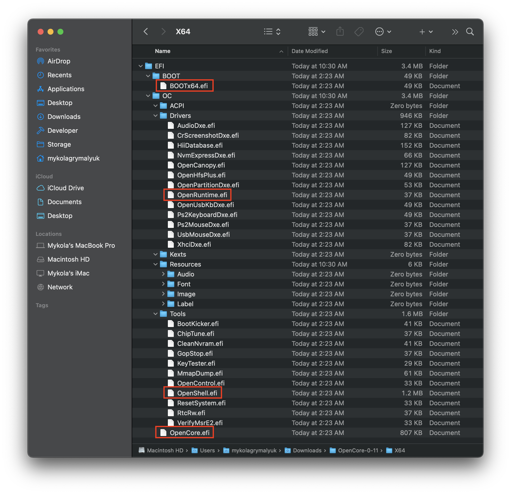

# Добавление базовых файлов OpenCore

* Поддерживаемая версия: 0.6.5

Чтобы настроить структуру папок OpenCore, вам нужно взять EFI папку, найденную в [релизах OpenCorePkg](https://github.com/acidanthera/OpenCorePkg/releases/). Обратите внимание, что они будут находится в IA32 или X64 папках; первая для 32-битных прошивок, вторая для 64-битных прошивок:

О DEBUG и RELEASE версиях:

* **DEBUG**: Может сильно помочь с отладкой проблем при загрузке, однако может добавить заметную задержку времени загрузки (например, 3-5 секунд, чтобы загрузиться в меню выбора). После установки вы можете легко перейти на RELEASE
* **RELEASE**: Значительно более быстрая загрузка, однако практически не представляет полезной отладочной информации, что делает более затруднительным решение проблем.

И когда выбора загрузили, положите папку EFI (из OpenCorePkg) в корень вашего EFI раздела:

**Примечание**:

* **Пользователям Windows:** вы захотите поместить EFI папку в корень USB накопителя, который вы ранее сделали
* **Пользователям Linux:** это раздел `OPENCORE`, который мы ранее создали.
  * Обратите внимание, что Метод 1 создает только 1 раздел, в то время как Метод 2 создает 2 раздела

Теперь, давайте откроем нашу EFI папку и посмотрим, что внутри:

Теперь кое-что, что вы заметите это то, что она поставляется с кучей файлов в `Drivers` и `Tools` папках, большинство из них нам не нужно:

* **Удалите из папки Drivers:**
  * AudioDxe.efi
    * Не связано с поддержкой звука в macOS
  * CrScreenshotDxe.efi
    * Используется для создания скриншотов в UEFI, нам это не нужно
  * OpenUsbKbDxe.efi
    * Используется для меню выбора (picker) OpenCore на **legacy системах, работающих под управлением DuetPkg** [не рекомендуется и даже вредно на Ivy Bridge и новее](https://applelife.ru/threads/opencore-obsuzhdenie-i-ustanovka.2944066/page-176#post-856653)
  * UsbMouseDxe.efi
    * Тоже самое, что и OpenUsbKbDxe; должна быть необходимость только на legacy системах, работающих под управлением DuetPkg
  * NvmExpressDxe.efi
    * Используется на Haswell и старее, когда NVMe драйвер не встроен в прошивку
  * XhciDxe.efi
    * Используется на Sandy Bridge и старее, когда XCHI драйвер не встроен в прошивку
    * Требуется только в том случае, если вы используете карту расширения USB 3.0 на старом компьютере
  * HiiDatabase.efi
    * Используется для исправления поддержки графического интерфейса, как OpenShell.efi, на Sandy Bridge и старее
    * Не требуется для загрузки
  * OpenCanopy.efi
    * Это опциональный графический интерфейс OpenCore, мы рассмотрим, как его настроить [После установки](https://dortania.github.io/OpenCore-Post-Install/cosmetic/gui.html), поэтому удалите его пока что
  * Ps2KeyboardDxe.efi + Ps2MouseDxe.efi
    * Довольно очевидно, когда это вам нужно, пользователям USB клавиатуры и мыши это не нужно
    * Напоминание: PS2 ≠ USB

* **Удалите всё из папки Tools:**
  * Их слишком много, чтобы перечислить все, но рекомендуется оставить OpenShell.efi для решения проблем

Почищенный EFI:

Теперь, вы можете положить **ваши** необходимые драйвера прошивки(.efi) в папку _Drivers_ и Кексты/ACPI в соответствующие папки. См. раздел [Сбор файлов](../ktext.md) для получения дополнительной информации о файлах, которые вы должны использовать.

* Пожалуйста, обратите внимание, что UEFI драйвера от Clover не поддерживаются с OpenCore! (EmuVariableUEFI, AptioMemoryFix, OsxAptioFixDrv, т.д.). См. раздел [Конверсия драйверов прошивки Clover'a](https://github.com/dortania/OpenCore-Install-Guide/blob/master/clover-conversion/clover-efi.md) для получения дополнительной информации о поддерживаемых драйверах и тех, которые были объединены в Opencore

Вот как **может** выглядеть заполненная EFI папка (ваш будет другим):

**Заметка**:

* SSDT и изменный (custom) DSDT(`.aml`) идут в ACPI папку
* Кексты(`.kext`) идут в Kexts папку
* Драйверы прошивки(`.efi`) идут в Drivers папку

# Теперь, когда это всё сделано, перейдите к [Сбору файлов](../ktext.md), чтобы получить необходимые kexts и драйверы прошивки
